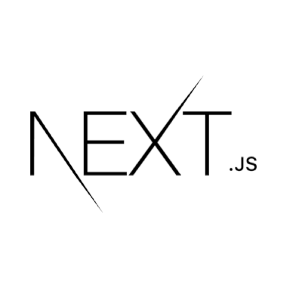

<br/>
<br/>

This is a [Next.js](https://nextjs.org/) project bootstrapped with [`create-next-app`](https://github.com/vercel/next.js/tree/canary/packages/create-next-app).
It contains boilerplate I use often:
-   Typescript
-   Inversify (for dependency injection)
    -   Decorators enabled (Babel config)
-   SASS
-   Some utility for mobile browsers

To use it:
```
npx create-next-app -e https://github.com/aouahib/nextjs-boilerplate
```
